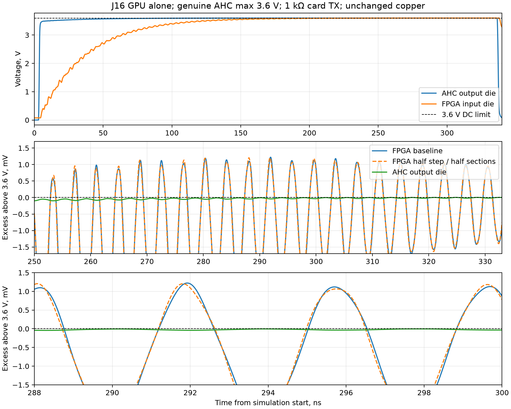

# Slot MISO model and supply audit, 2026-09-30

## Current status after the delegated card-side repair

The five card sources now contain genuine **TI SN74AHC1G125DCKR (C151890)**, a physical **270-ohm R60** series resistor and **10k R61** shunt to card ground. Shared library/pinout/assembly records are committed in `0beabbc`; card geometry is in `589a023`, and the 270-ohm supplier cache is in `9fa3286`. Main routing and FPGA voltage limits are unchanged. The older discriminators below describe the sequence leading to this repair; their statements that no candidate was adopted describe those earlier phases.

Qualification is still incomplete. The completed simulations use an immutable September 28 copper/netlist snapshot with explicitly inserted candidate components. They do not qualify the newly routed boards or satisfy current fabrication receipts. New physical outputs are being rebuilt sequentially; restricted networking currently prevents the JLC stock gate from completing. Development extraction must not turn those blocked receipts into passing evidence.

| Completed candidate screen | Cases | FPGA maximum / minimum, V | Latest threshold crossing, ns | Fixture-anchored buffer plus line, ns | Conditional RP2040 3 MHz margin, ns |
| --- | ---: | --- | ---: | ---: | ---: |
| Nearest/farthest, opposing 1% resistors, common ground | 640 | 3.5427 / -0.0226 | 28.54 | 38.1942 | 43.7845 |
| Nearest/farthest, opposing 3% resistors, maximum corner +40 mV card ground | 640 | 3.5881 / -0.0079 | 28.96 | 38.6142 | 43.3645 |
| Four interior slots, opposite line/load extreme, coupled package/passive extrema | 160 | 3.5763 / 0.0027 | 31.85 | 41.5042 | 40.4745 |

All three screens have zero voltage-stress failures. The first two independently cover DCK and FPGA package extremes, five card types, selected alone/all six slots populated, genuine minimum/maximum corners and connector bounds. Their line scale is 1.1 with maximum receiver capacitance. The interior screen adds J12–J15 at line scale 0.9/minimum receiver capacitance, but couples package/passive extremes to the driver corner; it is not a substitute for all independent combinations. Its minimum final high is 2.512552 V; the conditional unanchored 67.9787 ns deadline has high at least 2.439147 V and low at most 0.133126 V. A broader old-copper run was stopped under the root's instruction after 152 completed cases rather than spending approximately two hours repeating obsolete geometry.

The +40 mV ground offset is a constant engineering sensitivity envelope, pending actual routed ground/transient qualification. It shifts the physical card-ground reference and local die voltage gauge while retaining the genuine 3.6 V local-supply I/V and V/T model. It is not arbitrary waveform or supply scaling. At 3.5881 V the nearest/farthest screen leaves only 11.9 mV below the unchanged FPGA 3.6 V stress ceiling, so an unproved ground envelope cannot be credited as final safety evidence.

### Sampled-data qualification and model integration

SI now recognizes the exact TI part and physically traverses `/MISO_SRC`, R60, `/MISO` and R61. It rejects hypothetical series/shunt insertion into this fitted network. Genuine SHA-pinned TI SCLM008 corners and independent DCK package bounds replace the old same-family MDD proxy for these sources. Optional physical resistor scales include independent R60/R61/R107 bounds; a local card-ground sensitivity uses the same voltage-gauge method as the candidate study.

For genuine TI MISO data, early monotonicity/ringback failures remain reported as uniform-edge diagnostics. Required checks retain voltage stress, valid VIH/VIL, and the last threshold crossing before the setup deadline, with no later band recrossing through the simulated sampling interval. Clocks/control retain their original edge rules. Missing edge coverage fails. The deadline requires an actual routed SCK bound; without it, uniform-edge failures are not filtered.

The timing anchor is the genuine IBIS model into the datasheet **external 50 pF propagation fixture**, including DCK package. The model's 50%-VCC crossing is aligned to the TI **14 ns** worst-case propagation limit at 3.3±0.3 V, −40..125°C. Excess actual routed-load last-crossing delay is then added, rather than scaling delay by total capacitance or claiming the datasheet directly guarantees an overloaded distributed network. This is model-based qualification requiring first-article measurement. The conditional screens use the previously extracted RP2040/SCK allowance; the actual rebuilt SCK must be checked again. ESP32-C3 maximum SPI-slave response remains unpublished and unqualified. TI's corresponding 50 pF output-disable maximum is **16 ns**; actual CS skew/nonoverlap and driver release remain separate requirements.

Sixteen focused waveform, sampled-data, genuine-vendor and 3 MHz qualification regressions pass after adding missing-edge and physical tolerance/reference tests. The three routed legacy `MainSpi` regressions are checked separately. Tests cover early safe data ringing, late band recrossing failure, early overvoltage failure and unavailable valid data, without changing stress thresholds.

Artifacts: `/tmp/cupc8-si-resume/miso-dc270-matrix/{results,phase3-results,bounded-interior-results}.json`, associated input manifests/logs/summaries; `/tmp/cupc8-si-resume/miso-ahc50pf-anchor.json`; focused regression logs. The original phase3 process handle disappeared after the execution environment changed; 582 preserved results were backed up and only the 58 missing unique cases resumed to obtain a genuine 640-case terminal result. No duplicate phase3 process was started.

## Historical audit and discriminators

The modeled stress persists at the vendor's genuine nominal 3.3 V corner. The original 4.602 V result uses the TI proxy's 3.6 V maximum corner; that supply exceeds the main slot rail's modeled normal operation. Correcting the supply assumption reduces the predicted peak but does not establish safety. No main-board reroute or overshoot waiver is authorized by this audit, and MB-007 remains red.

## Supply and model basis

The worst recovered case is storage alone in J12, driving main U7.48, low line impedance scale 0.9, low bracketed input capacitance, populated connector model. Storage, GPU, IO and e-ink buffers receive the main board's +3V3 slot supply (`rp2040card.schematic`, U4 VCC); the storage buffer has no separate regulator. Wi-Fi's U3 buffer uses its own TLV62569-derived 3V3 rail, which must be bounded separately for a complete proof.

The main divider is 453k/100k, 0.1%, with TLV62569 feedback accuracy +/-2%. `design.buck_vout_range()` and the existing POW-001 receipt give 3.246–3.390 V DC. The vendor-model startup/release checks give at most 3.421 V; the design operating ceiling is 3.465 V. Thus 3.6 V is a conservative library corner, not the expected regulated supply. The 3.421 V result is a modeled power transient bound, not a guaranteed measurement of every rail disturbance.

`slowbus_si.LVC_AXES` currently sweeps min/max IBIS corners only. The ordinary MISO gate does not include a nominal typical-model case. The current driver is TI SN74LVC1G125 File Rev 1.3 as a same-family proxy for the fitted **MDD 74LVC1G125GW**, JLC/LCSC C52140430 (`hw/parts/C52140430.yaml`). The Nexperia datasheet limits used by the existing checker are also a family proxy; neither vendor is the actual fitted manufacturer. The Nexperia product page lists an exact IBIS file at [lvc1g125.ibs](https://assets.nexperia.com/documents/ibis-model/lvc1g125.ibs), dated 2014-10-20. Root's unrestricted fetch reached the vendor but returned HTTP 403; it is not downloaded or substituted.

The receiver is the vendor iCE40 input model with its clamp tables and package model. The driver also uses the TI output/clamp tables. This is not an unclamped ideal voltage source. Other pins without IBIS retain the documented capacitance/model brackets.

## Representative runs on unchanged copper

Existing `build/hw` copper/netlists were read, with one topology and unchanged corner parameters apart from the stated supply/model choice. Supply-only sensitivities retain maximum-corner I/V tables and vendor switching coefficients while changing circuit supply; they are not newly characterized IBIS corners.

| Driver model / supply | U7 peak, V | U7 minimum, V | Time above 3.6 V, ns |
| --- | --- | --- | --- |
| TI maximum, original 3.600 V | 4.6019 | -1.0140 | 5.80 |
| TI genuine typical, 3.300 V | 4.1389 | -0.8779 | 4.43 |
| TI maximum sensitivity, 3.421 V | 4.4086 | -0.9999 | 4.69 |
| TI maximum sensitivity, 3.465 V | 4.4561 | -1.0033 | 4.74 |

All exceed the implemented iCE40 stress bounds: 3.6 V DC, 3.66 V for <=1.6 ns, and -0.5 V lower limit. These simulated excursions establish an unresolved reliability concern; they do not demonstrate that the real fitted board will damage its FPGA, nor quantify a damage probability. Exact MDD edges, real rail/package/interconnect parameters and measurements remain missing.

Artifacts: `/tmp/cupc8-si-resume/miso-rail-audit.py`, `miso-rail-audit.json`, `miso-rail-audit.log`. The script preserves the vendor switching-model derivation and changes only the circuit supply for sensitivity runs. No gate, model source or board file was edited.

## Bounded card-side resistor diagnostics

A simulated resistor at the card buffer's output reduces receiver stress in this representative topology. These are hypothetical card changes, not main-board changes, and no resistor is added to the design.

| Card TX series, ohm | Model / supply | U7 peak / minimum, V | Last threshold settling, ns | Remaining checker failures |
| --- | --- | --- | --- | --- |
| 68 | typ / 3.3 | 3.3685 / -0.1020 | 8.4863 | early ringback, up to 558 mV |
| 68 | max sensitivity / 3.465 | 3.5917 / -0.1394 | 7.9150 | early fall ringback, 610 mV |
| 100 | typ / 3.3 | 3.3228 / -0.0251 | 9.3750 | rise ringback 454 mV, fall band reversal 921 mV |
| 100 | max sensitivity / 3.465 | 3.5170 / -0.0538 | 8.8150 | ringback, up to 1045 mV |
| 220 | typ / 3.3 | 3.3066 / +0.0077 | 18.3550 | threshold-band reversals, up to 532 mV |
| 220 | max sensitivity / 3.465 | 3.4746 / +0.0062 | 20.5907 | band reversals up to 611 mV and ringback |

Each passes voltage stress at U7 in this topology and still fails the unchanged edge-quality gate. The recovered broader sweep (128 configurations per value, 0/22/33/47/68/100 ohm, original min/max supply corners) had no value pass every configuration. It includes other slots/loading conditions; these representative results cannot supersede it.

MISO is sampled data. The current checker rejects any non-monotonic band traversal or threshold ringback anywhere after an edge; it does not require that the recrossing occur at the FPGA's sampling instant. In these six diagnostics, all recrossings end within 20.6 ns of the launched MISO edge. Their last-threshold-crossing measurement spans the whole modeled interval up to the next data edge, so the later part of that interval stays on the correct logic side.

At 3 MHz, half a bit is 166.7 ns. The recovered complete baseline turnaround calculation consumes 110.4 ns, including up to 21.185 ns of MISO line settling, and leaves 56.3 ns. These representative resistor cases do not exceed that baseline line-settling term. Therefore their early ringback does not by itself demonstrate a missed late data sample at 3 MHz. This is not a complete timing pass: all slot/population cases, card response/release, SCK path and card response/release still need the full existing timing proof. Current `rom/boot.s` and kernel GPU/storage/network/keyboard drivers already use divider 2 from 12 MHz, so actual software runs at 3 MHz; no software speed reduction is needed. At the time of these representative runs, the source checker used `SPI_HZ=6e6` as its required gate and calculated 3 MHz as a diagnostic alternative. The subsequent M1 operating-rate correction is recorded below; voltage thresholds remain unchanged.

Artifacts: `miso-card-series-audit.{py,json,log}` (100 ohm) and `miso-card-series-second.{py,json,log}` (68/220), under `/tmp/cupc8-si-resume`.

## Unadopted alternative

[TI SN74AHC1G125](https://www.ti.com/product/SN74AHC1G125) is a lower-drive pin-compatible family alternative; TI offers a DCK/SC70 package and an [IBIS model, SCLM008](https://www.ti.com/lit/ibs/SCLM008). A genuine model would allow a bounded slower-buffer diagnostic without inventing a slew rate. Root retrieved the genuine ASCII IBIS on 2026-09-30, File Rev 1.0, October 6 2008; source SHA256 `d3da7c3da68e8aa1e0531424c49b2419197530a8527d0248b276fc00eae4c971`. The file has a trailing 0xff byte, stripped only when decoding; original bytes are retained. The DCK component pin mapping is 1=NOE, 2=A, 3=GND, 4=Y, 5=VCC, matching the fitted GW part and board netlist. Package inductance is approximately 1 nH, consistent with the existing SC70 package approximation. Final footprint dimensions and assembly rotations require the datasheet review.

Vendor fixture replay for `AHC1G125_Y_33` passes all four typ/max rising/falling checks: maximum crossing error <=0.57 ps and endpoint error <=0.15 mV. The genuine model has typ/min/max rails 3.3/3.0/3.6 V. In the same J12 representative topology, AHC typ at 3.3 V gives 3.4939/-0.2574 V at U7, clean monotonic edges without ringback and <=5.155 ns settling. AHC max-driver supply sensitivity at 3.465 V gives 3.7369/-0.6495 V, with clean edges but voltage stress still failing. No driver slew is invented.

The simulation substitutes actual AHC input/output IBIS tables while using existing unchanged board/netlist geometry and its SC70 inductance approximation. Existing symbolic part labels and driver-limit classification still refer to LVC; this is an exploratory electrical comparison, not a release gate for a newly fitted part. Input thresholds, propagation and enable/disable timing and fitted-part availability require review before any substitution. AHC plus a 22-ohm card resistor clears representative voltage stress and edge quality at typ 3.3 V (3.3473/-0.0135 V, <=5.44 ns settling) and max-driver sensitivity at 3.465 V (3.5348/-0.2407 V, <=4.75 ns settling). Unscaled genuine 3.6 V maximum still gives 3.6659 V, 5.9 mV above the 3.66 V transient limit, and the gate correctly fails. Thus the combination is promising at the board supply and is not a complete conservative-corner proof.

The official DCK datasheet pin map matches the fitted GW map; pitch 0.65 mm, body 2 x 1.25 mm and terminal span 2.1 mm identify the SC70/DCK package, but do not prove that the original MDD lands are suitable. At VCC=3.3 V +/-0.3 V and -40..85 C, propagation maximum is 9.5 ns into 15 pF or 13 ns into 50 pF; output release maximum is 11.5 ns / 15 ns. These exceed the current LVC 4.5 ns term and need explicit turnaround/release updates before substitution. AHC uses CMOS input thresholds, so input-level margins also need explicit review; retaining the existing symbolic LVC pin classifications cannot be credited as an AHC release proof. A final bounded AHC+33-ohm pair passes the genuine unscaled 3.6 V maximum case (3.6446/-0.0608 V, clean edges, <=4.90 ns settling; its brief exceedance of 3.6 V stays inside the existing AC allowance), but the genuine nominal 3.3 V case fails falling-edge ringback by 187 mV (3.3331/-0.0087 V, final settling 7.59 ns). The subsequent delegated candidate audit below explores whether the early data ringback is relevant to sampling. No part has been selected. No arbitrary slower edge has been credited as proof.

## Candidate matrix continuation

The user subsequently delegated reasonable decisions to finish the work. A scratch AHC+33 candidate matrix reuses the original nearest/farthest J11/J16 GPU/storage, alone/all-loaded, 128-case min/max driver/line/load/connector matrix, with independent minimum/maximum DCK package envelopes (256 simulations). All selected and disabled card buffers use genuine AHC output IBIS tables and consistent package R/L/C; disabled outputs are additionally probed for stress. AHC driver/output voltage classifications use -0.5 to VCC+0.5 V rather than the previous LVC input limit. The unchanged edge checker still reports early data ringback; no voltage threshold is relaxed and no board source/BOM substitution is made.

The completed 256-case matrix took 253 seconds with zero simulation errors. **100 cases fail voltage stress**, and only 24 pass the unchanged complete edge checker. Worst U7.48 peak is **4.0679 V** (J16 GPU alone, maximum driver, line scale 1.1, low package envelope, connector model 0); worst trough is **-0.5210 V** (J11 storage alone, maximum driver, line scale 1.1, high package envelope, connector model 0). This rejects AHC+33 under genuine vendor maximum corners. For example, J11, all GPU, maximum driver, line scale 1.1, low package envelope, populated connector gives U7.48 **3.675 V for 2.84 ns above 3.6 V**. That exceeds both the 3.66 V peak and 1.6 ns duration allowance. The high package envelope gives 3.672 V for 2.71 ns. Another configuration stays at 3.627 V but remains above 3.6 V for 2.55 ns. These are voltage-stress failures, so a physically justified sampled-data criterion would not make AHC+33 pass.

The matrix captures explicit circuit capacitance for timing review. The total modeled shunt capacitance ranges from 35.49 to 77.53 pF; early all-GPU configurations contain 65.7–73.4 pF, above the datasheet 50 pF characterization condition; the 13/14 ns propagation maximum cannot automatically be credited as a bound on these loads. This sum includes die/package/interconnect/connector shunts; a resistor-separated distributed network is not identical to the datasheet fixture.

Artifact: `/tmp/cupc8-si-resume/miso-ahc33-matrix.{py,json,log}`. The completed JSON retains all individual cases; `miso-ahc33-matrix-summary.json` records extrema and failure counts, and `miso-ahc33-matrix-inputs.json` records input hashes. All input board files had September 28 modification times and were unchanged during the run. These are the preserved `build/hw` boards used by the original MB-007 audit, not the subsequent fresh canonical GPU rebuild. Its coverage does not include interior slots, typical corners, Wi-Fi, enable/disable transients or complete timing proof. The worst U7 final threshold crossing is 11.08 ns after launch. In the existing 3 MHz turnaround accounting, substituting this line-settling term and a 14 ns AHC propagation allowance would leave approximately 56.9 ns before the sample setup deadline. This is conditional arithmetic: the 14 ns datasheet maximum is characterized only through 50 pF, so it is not credited as a timing proof for the higher modeled bus load. The waveform shows no later threshold recrossing in its modeled inter-edge interval, supporting the distinction between early data ringback and late data sampling; voltage stress independently fails.

At -40..125 C, AHC output disable can take 16 ns at 50 pF. ROM and kernel card drivers explicitly write CS hold zero in `cs_off` before later `cs_on` calls, separated by many 12 MHz CPU cycles. The raw `soc/spi_master.vhd` selector can nevertheless change directly from a held device to a different active device, without analog nonoverlap, and the existing SI cases hold every nonselected output permanently disabled. Those cases do not prove release/contention during handover. No enable/disable or first-bit timing signoff is inferred from one-hot logical CS selection. Existing gate code and PCB/BOM sources remain unchanged by the electrical candidate study. GPU copper experiments remain parked; only the necessary GPU and IO silk guard expectations have subsequently been updated for the shared mask-aware clearance fix.

Additional artifacts under `/tmp/cupc8-si-resume`: `SCLM008` (unmodified TI download), `sn74ahc1g125.pdf`, `ahc-fixture.{py,json,log}`, `miso-ahc-audit.{py,json,log}`, `miso-ahc22-audit.{py,json,log}`, `miso-ahc22-globalmax.{py,json,log}`, `miso-ahc33-audit.{py,json,log}`.

## Stronger card-resistor discriminator

A subsequent requested bounded discriminator tested four points: J16 GPU alone, J11 GPU alone, J11 storage alone (line scale 1.1, connector model 0), and J11 all GPU (line scale 1.1, connector model 1). Each candidate used genuine min/typ/max vendor supply corners and independent low/high DCK package bounds: 24 simulations per candidate, 72 total, all finished in 70 seconds without simulation errors. The cached official TI LVC IBIS explicitly contains `LVC1G125_DCK`; its pin map and package R/L/C envelope match the AHC DCK component. Thus the LVC candidate models the exact TI family/package rather than assuming the MDD part has identical edges. No model supply was scaled.

| Candidate | Cases failing voltage stress | U7 peak / trough, V | Worst final threshold settling, ns |
| --- | --- | --- | --- |
| TI LVC + 220 ohm | 2/24 | 3.6887 / -0.0777 | 32.868 |
| TI AHC + 150 ohm | 2/24 | 3.6954 / -0.0788 | 19.800 |
| TI AHC + 220 ohm | 2/24 | 3.6599 / -0.0352 | 26.200 |

All three candidates still fail J16 GPU-alone genuine maximum-corner stress. LVC+220 gives 3.689 V for 2.01 ns above 3.6 V. AHC+150 gives 3.695 V for 1.95 ns. AHC+220 stays just below the 3.66 V peak ceiling (3.6599 V) but remains above 3.6 V for 1.94 ns, exceeding the independent 1.6 ns allowance. The early sampled-data distinction cannot erase any of these voltage-stress failures. No candidate is adopted, and no broad stronger-resistor sweep has been inferred from these points.

The available AHC C151890 EasyEDA footprint has matching numbered-pin layout after rotation. The independent physical audit of the actual generated KiCad footprint establishes a relative 270-degree (−90-degree) placement rotation from the old SOT353 footprint; the earlier EasyEDA coordinate comparison did not establish the KiCad placement sign. Its recommended pad centers are 1.1 mm from the centerline, versus 0.9 mm on the existing MDD footprint, and its pad length is 0.9 mm versus 0.6 mm. Matching package pitch alone is insufficient to credit the original lands and assembly rotation. Source footprint updates and actual DRC would be necessary before a part substitution.

Artifacts: `/tmp/cupc8-si-resume/miso-strong-resistor-audit.{py,json,log}` and `miso-strong-resistor-summary.json`. The scratch scripts use a common internal output classification label for both vendor families; the per-case `candidate_family` and genuine-model driver note distinguish them. Enabled-output voltage limits remain VCC+0.5 V, and the disabled LVC outputs are conservatively checked against the same bound. Existing PCB/BOM sources and gate remain unchanged. No SI jobs remain active.

## Further bounded damping tests

The requested AHC 270/330/470 and TI LVC 330/470 resistor-only discriminator completed 120 simulations in 117 seconds. Every candidate still fails both DCK package extremes of J16 GPU-alone genuine maximum-corner stress. Increasing resistance reduces the crest but the reflection remains above 3.6 V for approximately 1.9 ns. No full candidate matrix is justified by these failures.

| Candidate | U7 peak, V | Worst settling, ns |
| --- | --- | --- |
| TI AHC + 270 ohm | 3.6439 | 31.500 |
| TI AHC + 330 ohm | 3.6311 | 37.990 |
| TI AHC + 470 ohm | 3.6152 | 52.360 |
| TI LVC + 330 ohm | 3.6466 | 47.665 |
| TI LVC + 470 ohm | 3.6207 | 66.015 |

The further AHC/LVC 680/1000-ohm cases use actual 3 MHz SPI data periods and retain genuine min/typ/max supply corners. All 96 simulations finished in 169 seconds without simulation errors. Again each candidate has two voltage-stress failures. AHC+1000 peaks at only 3.6012 V, but its 1.71 ns excursion still exceeds the duration gate. No tolerance is applied to erase a small excess.

| Candidate | U7 peak, V | Worst settling, ns |
| --- | --- | --- |
| TI AHC + 680 ohm | 3.6057 | 74.620 |
| TI AHC + 1000 ohm | 3.6012 | 108.470 |
| TI LVC + 680 ohm | 3.6076 | 95.495 |
| TI LVC + 1000 ohm | 3.6016 | 138.365 |

These larger resistors also use too much of the sample budget. The baseline turnaround arithmetic leaves approximately 67.98 ns for AHC line settling with a 14 ns buffer term, or 77.48 ns for TI LVC with its 4.5 ns, -40..85 C propagation term. AHC+680 reaches only 0.913 V on the falling edge at that deadline; AHC+1000 is 1.964 V rising and 1.385 V falling. Those sampled levels violate U7 VIH=2.0/VIL=0.8 independently of early edge monotonicity. Deadline metrics are conditional on existing SCK/response accounting and the datasheet load assumptions, not a new timing gate. Official TI SCES223U (August 2026), sections 5.7/5.8, gives LVC at 3.3 V +/-0.3 V and 50 pF: tpd=4.5 ns and output release=5 ns through 85 C; at 125 C, tpd=4.7 ns, release=5.2 ns and enable=5.6 ns. The 125 C deadline is therefore 0.2 ns shorter than the scratch LVC diagnostic.

Next requested passive-filter tests add a real 10/22 pF capacitor from the card-side MISO trace to ground after a 220-ohm TX resistor, on every populated selected or disabled card, for both genuine TI families. This changes a physical circuit element and does not alter vendor switching schedules or supply corners. A preliminary scratch run omitted the selected-driver capacitor; circuit-capacitance verification caught the error, that run was stopped and its partial results moved to `miso-output-rc-invalid.{py,json}`. It supplies no candidate evidence. The corrected driver path has an insertion assertion; single-card capacitance increases by exactly the proposed capacitor value.

Artifacts: `/tmp/cupc8-si-resume/miso-larger-resistor-audit.{py,json,log}`, `miso-largest-resistor-audit.{py,json,log}` and their summary files; corrected passive-filter results will be in `miso-output-rc-audit.{py,json,log}`. Source `slowbus_si.py` assumptions and `slowbus_models.py` docstrings now explicitly identify the fitted MDD part and the unverified family proxies; electrical gates and thresholds remain unchanged.

## Passive-filter results and numerical audit

The corrected direct-shunt filter tests all finished (96 cases, 166 seconds, no simulation errors). With 220-ohm TX, 10 pF produces four stress failures for each vendor family; 22 pF produces six for each. AHC worst settling is 48.62/74.50 ns; LVC is 53.825/78.955 ns. The added capacitance changes which slot fails and does not establish safe voltage stress.

The dissipative alternative uses 100-ohm TX plus a separate 100-ohm resistor in series with a 10/22 pF capacitor to card ground. It supplies physical AC loss while remaining open at DC, and is fitted to every modeled card output. All 96 genuine-corner/package cases finish in 166 seconds without simulation errors. Every combination still fails the far-slot voltage-duration check (two cases per candidate):

| AC shunt candidate | U7 peak / trough, V | Worst settling, ns |
| --- | --- | --- |
| TI AHC, shunt 100 ohm + 10 pF | 3.6564 / -0.0484 | 26.330 |
| TI AHC, shunt 100 ohm + 22 pF | 3.6154 / -0.0101 | 40.180 |
| TI LVC, shunt 100 ohm + 10 pF | 3.7463 / -0.1468 | 26.705 |
| TI LVC, shunt 100 ohm + 22 pF | 3.6913 / -0.0916 | 38.935 |

No candidate passed voltage stress, so no broader candidate loading matrix, new footprint import or PCB/BOM adoption followed these discriminators. Further RC exploration is stopped.

The tiny AHC+1000 excursion was then rerun at half the ladder section length and half the time step, with saved source-die and FPGA-die waves. Peak changes from 3.60122261 to 3.60120525 V (17.36 microvolts); longest above-3.6 interval changes from 1.71 to 1.70 ns, retaining the same stress verdict. The plotted late ripple has roughly a 4 ns period; it appears strongly at the remote receiver and weakly at the source. This is consistent with reflected energy in the modeled interconnect, not a fixed above-rail driver level or an error removed by mesh/time refinement. The plot identifies model behavior, not measured silicon damage probability.

Static I/V evaluation at Ku=1/Kd=0 gives the unloaded AHC maximum model equilibrium 3.5999999999 V and LVC equilibrium 3.599865 V. Both reconstructed switching schedules end at exactly Ku=1/Kd=0. This excludes a forced above-rail DC plateau from the final switching weights. The existing conversion evaluates pullup/power-clamp tables at VCC−Vpad, consistent with the [IBIS quality guidelines](https://ibis.org/quality_ver3.0/quality_ver3.0.pdf); there is no detected sign/reference correction that would remove the failure.

The [IBIS 7.1 specification](https://www.ibis.org/ver7.1/ver7_1.pdf), voltage-reference sections and pages 94–96, distinguishes reference-node voltage changes from drive-strength modulation. Its optional ISSO tables describe modulation of pullup/pulldown behavior as supply references move. Neither cached TI IBIS 3.2 file contains ISSO PU/PD, Composite Current or an External Model. Changing the external rail therefore has meaningful reference algebra, but does not by itself establish a characterized or guaranteed conservative fast-process envelope at an intermediate supply. The earlier actual-rail runs remain explicitly sensitivities. This is consistent with the [IBIS forum's power-aware modeling discussion](https://ibis.org/minutes/min2016/m051116.pdf), which notes supply dependence of switching profiles.

A future actual-supply proof also needs per-card power and ground: the Wi-Fi buffer has a local regulator, with a modeled buck upper around 3.562 V under a requested stress corner; its local ground can rise relative to main FPGA ground. The other four card types use the main slot rail. A single globally reduced VCC would omit those differences. The conservative global 3.6 V gate is retained, and no supply shift is accepted as a stress waiver.

Artifacts: `miso-output-rc-audit.{py,json,log}`, `miso-ac-termination-audit.{py,json,log}`, `miso-wave-audit.{py,json,log}`, `miso-ahc1000-{baseline,refined}.npz`, `plot-miso-wave-audit.py`, `ibis7_1.{pdf,txt}`, under `/tmp/cupc8-si-resume`; exported plot beside this report. No SI jobs remain active.

## M1 operating-rate correction

Under the user's delegated engineering decision, source qualification now explicitly uses `QUALIFIED_SPI_HZ=3e6`, matching ROM/kernel divider 2. `SPI_HARDWARE_MAX_HZ=6e6` remains a separate unsupported analog diagnostic. The simulated slot waveforms use 3 MHz, MOSI setup/hold and MISO turnaround require the 3 MHz sample budget, and the diagnostic's result cannot be represented as a 6 MHz analog qualification. Public `doc/hardware/slot.md` records that scope and the separate output-release/nonoverlap requirement.

Seven focused tests pass: existing waveform stress/edge checks plus regressions for a passing required 3 MHz budget with a flagged 6 MHz miss, a failing required 3 MHz budget, and the correct waveform half-period. Log: `/tmp/cupc8-si-resume/test-qualified-spi.log`. These verify the qualification calculation and preserved thresholds; they are not a new full MB-007 run. Voltage stress remains red. The whole-edge MISO criterion is unchanged because no stress-safe candidate and complete timing/release proof was established. No FPGA stress bound or current limit was relaxed.

The three existing routed `MainSpi` regressions also pass at the new default 3 MHz: lightly loaded baseline passes, removing the source resistor fails stress, and the fully loaded case retains its edge-quality failure. Runtime 15.383 seconds; log `/tmp/cupc8-si-resume/test-qualified-spi-routed.log`. Thus 10 focused regressions passed in total. No active SI processes remain.

## Deliberate card-side DC attenuation discriminator

A subsequent authorized study adds a genuine TI AHC output, TX series resistor, and resistor from the connector side of that series resistor to card ground. Every populated output, including disabled outputs, receives the shunt. Deck instrumentation confirms one shunt for a single card and six for the fully occupied six-slot bus. The original main R107 47k pull-up remains in the extracted circuit. This is deliberate passive DC attenuation, with real current consumption; it does not alter voltage limits or source corners.

The first 48 genuine min/typ/max and independent DCK-package extreme cases cover the four previously failing geometries. Both candidates pass every voltage-stress check, while all cases still fail the unchanged whole-edge monotonicity check:

| TX / shunt | U7 peak / trough, V | Worst final settling, ns | Minimum final high, V | Minimum high / maximum low at conditional 3 MHz deadline, V |
| --- | --- | --- | --- | --- |
| 330 ohm / 20k | 3.5679 / -0.0019 | 32.37 | 2.70407 | 2.587862 / 0.169354 |
| 470 ohm / 33k | 3.5617 / 0.0231 | 45.59 | 2.749164 | 2.463172 / 0.401226 |

Runtime was 83 seconds. These are discriminators on the previous routed boards, not complete qualification or PCB adoption. The sample voltages use the previously described conditional 14 ns AHC delay allowance; total capacitive load, actual source-input timing, output release and independent receiver corners still require proof.

The idle audit finds a separate issue with these values. A single 20k or 33k shunt competes with the existing 47k pull-up, yielding approximately 0.985 V or 1.361 V at 3.3 V: neither guarantees FPGA low or high. A 10k shunt instead guarantees idle low (at most about 0.643 V with a 3.66 V pull-up rail and independent 1% resistor tolerances). The follow-up AHC330/10k discriminator passes stress in all 24 cases, peak 3.5067 V, trough -0.0028 V, worst final settling 33.75 ns, in 41 seconds. Its all-six-card conservative DC check uses the TI guaranteed 2.48 V VOH at VCC=3 V and IOH=-4 mA: ignoring helpful pull-up current, the maximum 333.3-ohm TX and six minimum 9.9k shunts give approximately 2.063 V at the bus, above the FPGA's 2.0 V VIH but with only 63 mV margin. The guaranteed VOH bound therefore deserves attention alongside the modeled waveform, rather than assuming a rail-level driver.

Idle low changes the public slot protocol's empty-slot `$FF` convention. ROM `probe_slot` does not consult PRSNT: a zero RESP_LEN repeats a finite 20 attempts and then records an empty slot, so an absent slot remains correctly rejected with approximately 100 ms added probe delay. Kernel drivers are selected using the ROM's verified card signature/type table. Slot documentation explicitly requires power-off-only card changes; hot removal is outside that operating scope. In particular, an already selected GPU's free-space poll would not recover from disappearance with an idle-low bus. No protocol source or public idle contract has been changed yet.

Artifacts: `/tmp/cupc8-si-resume/miso-dc-shunt-audit.{py,json,log}` and `miso-dc-shunt10k-audit.{py,json,log}`. Additional 220/270-ohm TX with 10k-shunt discriminators completed 48 cases in 82 seconds: both pass all bounded stress checks. The 220-ohm result peaks at 3.5718 V with 23.05 ns worst final settling; 270 ohms peaks at 3.5385 V with a -0.0177 V trough and 28.01 ns worst final settling. Conservative static VOH floors using the same 2.48 V datasheet bound and 1% resistor extremes are approximately 2.186 V (220 ohms) and 2.126 V (270 ohms). The latter gives a useful initial compromise between stress and guaranteed logic-high margin. These results are in `miso-dc-shunt10k-faster-audit.{py,json,log}`. No SI jobs remain active; broader current-copper coverage is the next step, once the rebuilt input boards are available. No model or checker voltage bound has changed, and no buffer, resistor or footprint is adopted.

GPU status has advanced independently: the launch repair and its geometry/DRC/SI evidence are recorded in [the GPU launch report](m1-resume-gpu-launch-2026-09-30.md). Earlier parked candidate9 notes in this audit are superseded by that report.

The authorized 270-ohm/10k follow-up is running a 640-case candidate-only matrix on an immutable, hashed September 28 board/netlist snapshot: nearest/farthest slots, all five card types, selected alone or all six slots populated, genuine minimum/maximum corners, both connector envelopes, independent DCK and FPGA package extremes, and opposing 1% TX/shunt tolerance extremes. Line impedance uses scale 1.1 and receiver capacitance uses its maximum for this first discriminator. Current rebuilt copper, the other line/load extremes, interior slots, additional resistor combinations and mixed card placement are not credited by this bounded matrix. Input manifest: `/tmp/cupc8-si-resume/miso-dc270-matrix/inputs.json`; incremental output `results.json`, log `run.log`. No shared SI source is edited during the frozen run.

### Conservative DC margins and next integration requirements

The preliminary 1% matrix is frozen; production passive qualification must also include temperature coefficient. For the proposed basic resistors, a conservative independent ±3% bound covers initial tolerance and the reported ±100 ppm/°C envelope; physical part codes/TCR still require primary supplier verification. Applying ±3% to both the card shunt and existing R107, using a 3.66 V pull-up rail, and adding the maximum positive FPGA input leakage (10 µA) plus one disabled AHC output leakage (2.5 µA), gives the worst single-card idle approximately 0.779 V. This remains below VIL=0.8 V, with about 21 mV DC margin; the FPGA's internal input pull-up must stay disabled. No-card idle remains high because there is no card shunt.

At the other static extreme, TI guarantees AHC VOH≥2.48 V at VCC=3 V and IOH=-4 mA over the operating temperature range. Six minimum 9.7k shunts, maximum 278.1-ohm TX, five disabled AHC outputs sinking 2.5 µA each, and the FPGA sinking 10 µA give a conservative bus high around 2.111 V, excluding helpful R107 pull-up current. The main FPGA receives more than its 2.0 V VIH. This static bound is separate from the model's higher final plateau.

[The official Lattice LP/HX datasheet](https://www.latticesemi.com/view_document?document_id=49312), Tables 4.5 and 4.13, provides the ±10 µA input leakage with internal pulls disabled and VOH≥VCCIO−0.4 V at the configured load class (VCCIO−0.2 V at 0.1 mA). Even VCCIO=3.135 V gives a conservative 2.735 V control high, above the AHC worst 2.52 V input requirement. AHC IOZ≤2.5 µA is in the official TI datasheet. The local source and receiver supplies must be treated consistently when checking MCU data-input VOH; an independently reduced source amplitude and maximum AHC supply cannot automatically be asserted for two devices sharing a card regulator.

Actual SI integration is planned around exact buffer value `SN74AHC1G125DCKR`, output `/MISO_SRC` at U4.4 (Wi-Fi U3.4), R60 from `/MISO_SRC` to `/MISO`, and R61 from `/MISO` to `/GND`. These are proposed labels, not adopted hardware. Normal extracted-netlist resistor traversal must include R60/R61; hypothetical candidate TX/shunt insertion must be rejected for an already populated physical network. The actual buffer family needs its genuine model, correct input/output voltage classification, characterized DCK package, and driver discovery through the real series resistor. Output-enable/release timing and distributed-load propagation remain separate proof obligations. The ESP32 slave's unpublished maximum analog response timing remains visible rather than being inferred from an RP2040 PIO calculation.

The existing FPGA image's SPI_MISO internal pull-up is verified disabled in the actual `.asc`: IceStorm's `8k-tq144:4k` mapping places pin 48 at I/O tile (16,0), block 0; `icebox_explain` reports `IoCtrl REN_0`. The installed IceStorm converter emits this bit only for `disable_pull_up`. Configuration evidence: `/tmp/cupc8-si-resume/chipset-miso-io-config.txt`; image SHA256 is recorded in the candidate manifest. A future regenerated FPGA image must retain that configuration.
